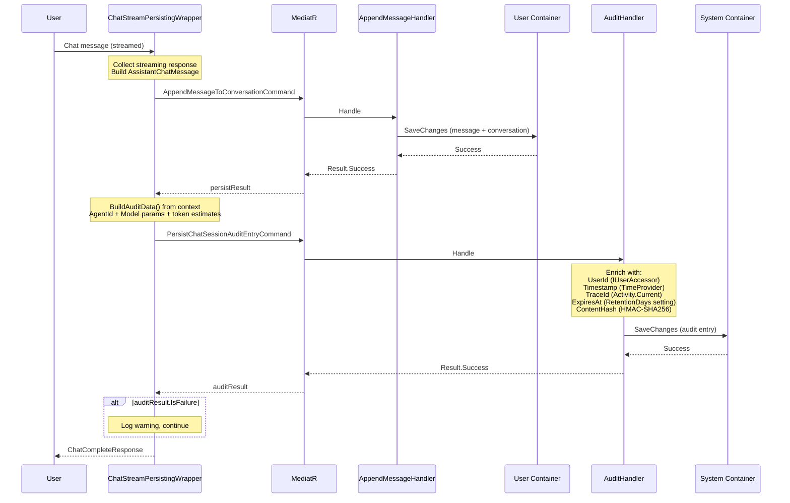
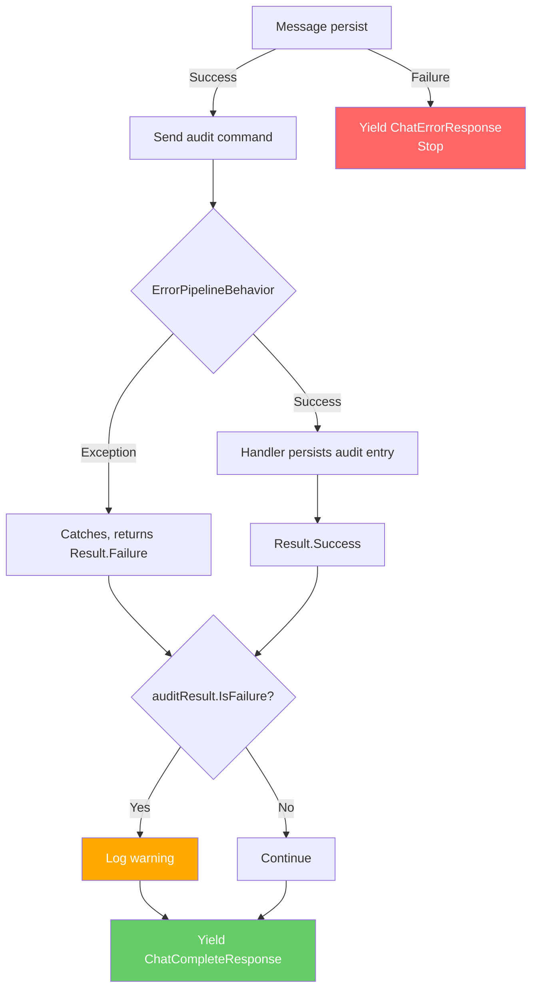
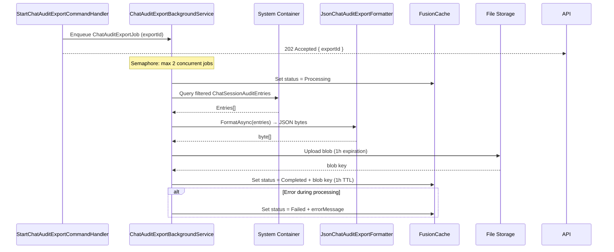
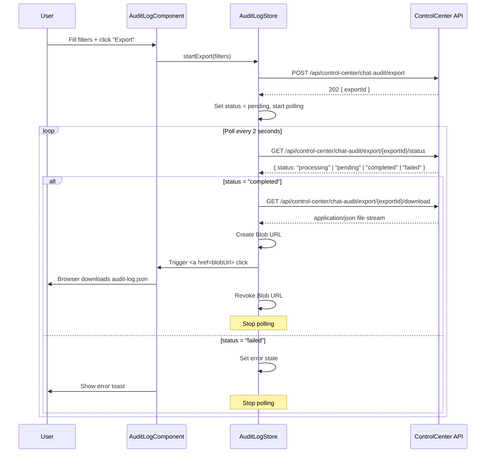
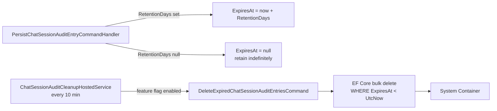
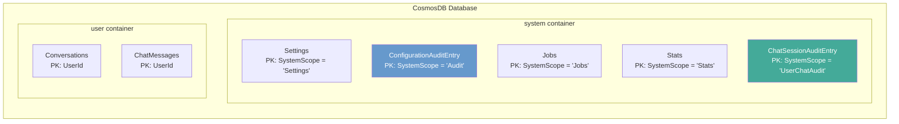
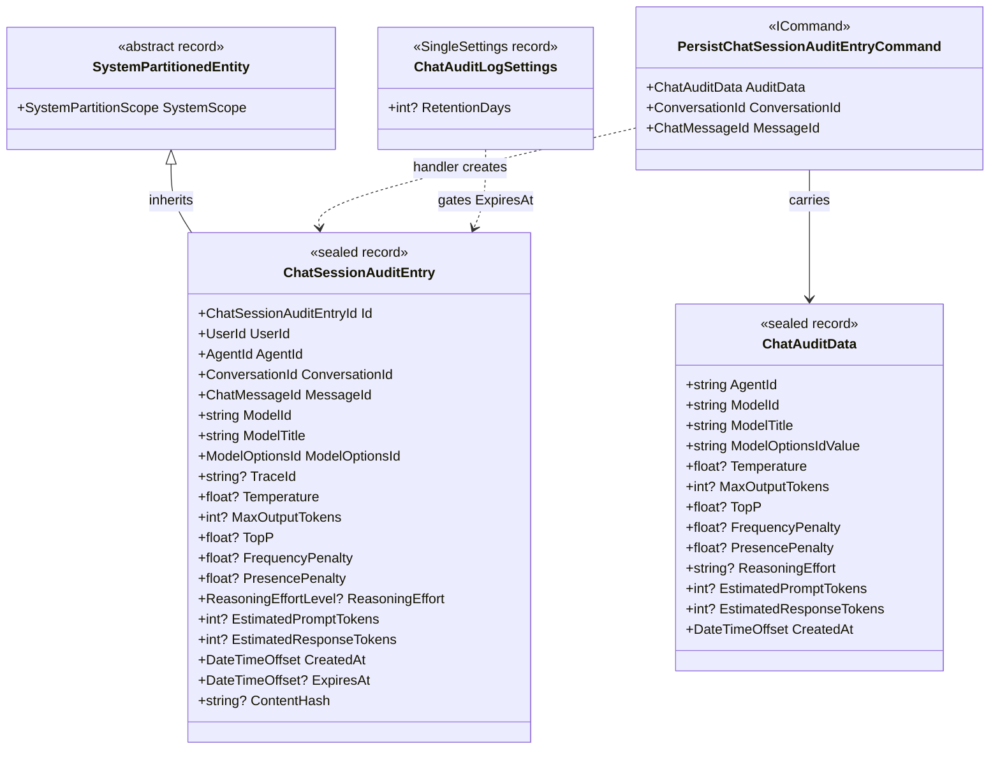
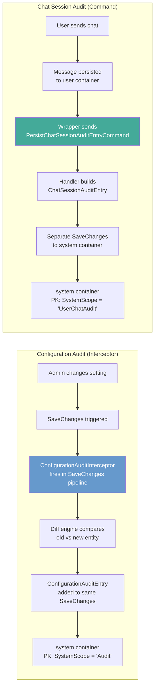

# Chat Session Audit — Architecture Overview

## Context

The adessoGPT Audit system has two distinct audit types:

| Aspect | Configuration Audit | Chat Session Audit |
|--------|--------------------|--------------------|
| **Trigger** | Admin changes a system setting | User sends a chat message (LLM call) |
| **Volume** | Low (admin operations) | High (every LLM call) |
| **Pattern** | EF Core `SaveChangesInterceptor` | Explicit MediatR Command |
| **Container** | `"system"` (PK: `SystemScope = 'Audit'`) | `"system"` (PK: `SystemScope = 'UserChatAudit'`) |
| **Data** | Property-level diffs (old vs new) | LLM call snapshot (model, params, tokens) |

---

## System Overview

```mermaid
graph TB
    subgraph Frontend
        UI[AuditLogComponent<br/>+ SettingsComponent]
    end

    subgraph Presentation
        API[Chat Endpoint]
        CCAPI[ControlCenter ChatAudit Endpoints]
        SETAPI[ControlCenter Settings Endpoint]
    end

    subgraph Application
        CSW[ChatStreamPersistingWrapper]
        PAC[PersistChatSessionAuditEntryCommand]
        PAH[PersistChatSessionAuditEntryCommandHandler]
        EXP[StartChatAuditExportCommand]
        BG[ChatAuditExportBackgroundService]
        CLN[ChatSessionAuditCleanupHostedService]
        DEL[DeleteExpiredChatSessionAuditEntriesCommand]
    end

    subgraph Domain
        CSA[ChatSessionAuditEntry]
        SETS[ChatAuditLogSettings]
        ISC[ISystemDbContext]
    end

    subgraph Infrastructure
        CDB[(CosmosDB<br/>"system" container)]
        MDB[(MongoDB<br/>"system_chat_session_audit")]
        CACHE[(FusionCache<br/>export status)]
        STORE[(File Storage<br/>export blob)]
    end

    UI --> CCAPI
    UI --> SETAPI
    API --> CSW
    CSW --> PAC
    PAC --> PAH
    PAH -->|creates| CSA
    PAH --> ISC
    ISC --> CDB
    ISC --> MDB
    CCAPI --> EXP
    EXP --> BG
    BG --> CACHE
    BG --> STORE
    SETAPI --> SETS
    SETS --> ISC
    CLN --> DEL
    DEL --> ISC
```

---

## Data Flow: Write Path



---

## Data Flow: Error Resilience



**Key principle:** A failed audit write never blocks the user's chat. The message is already persisted — the user gets their response regardless.

---

## Settings

### ChatAuditLogSettings

Stored as a `SingleSettings` document in the `"system"` container. Managed via the Control Center UI.

| Property | Type | Default | Description |
|---|---|---|---|
| `RetentionDays` | `int?` | `null` | Days after which entries expire. `null` = retain indefinitely. |

**Feature flag:** `"ChatAuditLog"` — gates all persistence and export operations. Implemented by `ChatAuditLogFeatureProvider`. Consumed via `IsChatAuditLogEnabledAsync()` extension method.

**Settings endpoint:** `GET/PUT /api/control-center/chat-audit-log-settings` (requires `ControlCenterAdmin`)

---

## API Endpoints

All endpoints under `/api/control-center/chat-audit` require `ControlCenterAdmin` role.

| Method | Route | Handler | Description |
|--------|-------|---------|-------------|
| `GET` | `/api/control-center/chat-audit` | `GetChatSessionAuditQueryHandler` | List audit entries (paginated, filtered) |
| `GET` | `/api/control-center/chat-audit/{id}` | `GetChatSessionAuditEntryByIdQueryHandler` | Get single entry by ID |
| `POST` | `/api/control-center/chat-audit/export` | `StartChatAuditExportCommandHandler` | Enqueue export job — returns `202 Accepted` + `exportId` |
| `GET` | `/api/control-center/chat-audit/export/{exportId}/status` | `GetChatAuditExportStatusQueryHandler` | Poll export job status |
| `GET` | `/api/control-center/chat-audit/export/{exportId}/download` | `DownloadChatAuditExportQueryHandler` | Download completed export file |
| `GET` | `/api/control-center/chat-audit-log-settings` | `GetControlCenterChatAuditLogSettingsQueryHandler` | Get settings |
| `PUT` | `/api/control-center/chat-audit-log-settings` | `UpsertControlCenterChatAuditLogSettingsCommandHandler` | Update settings |

**List query filters:** `UserId`, `ConversationId`, `ModelOptionsId`, `FromDate`, `ToDate`, `PageNumber`, `PageSize`

**Export filters:** `UserId`, `ModelOptionsId`, `FromDate`, `ToDate`, `Format` (currently `"json"` only)

---

## Export Pipeline



**Components:**

| Class | Responsibility |
|---|---|
| `StartChatAuditExportCommandHandler` | Validates filters, enqueues job, returns `exportId` |
| `ChatAuditExportBackgroundService` | `IHostedService`; channel-based queue; semaphore for concurrency |
| `ChatAuditExportJob` | Job payload: `ExportId`, `UserContext`, filter params |
| `ChatAuditExportEntry` | DTO for serialization (all IDs as strings) |
| `IChatAuditExportFormatter` / `JsonChatAuditExportFormatter` | Formats entries as indented camelCase JSON |
| `IChatAuditExportDownloadStrategy` / `StreamingChatAuditExportDownloadStrategy` | Streams file through backend (on-premise/MinIO) |
| `GetChatAuditExportStatusQueryHandler` | Reads status from FusionCache |
| `DownloadChatAuditExportQueryHandler` | Reads blob key from cache, delegates to download strategy |

---

## Frontend: Download Flow



**State shape (NgRx Signals):**

| Signal | Type | Description |
|---|---|---|
| `exportStatus` | `'idle' \| 'pending' \| 'processing' \| 'completed' \| 'failed'` | Current export job state |
| `exportId` | `string \| null` | Active export job ID |
| `isExporting` | `boolean` (computed) | True while polling is active |
| `exportError` | `string \| null` | Error message if failed |

**Filter defaults:** `FromDate` = today minus 7 days, `ToDate` = today, `Format` = `"json"`

---

## Data Retention & Cleanup



- The `ExpiresAt` field is set at write time based on `ChatAuditLogSettings.RetentionDays`.
- `ChatSessionAuditCleanupHostedService` runs on a 10-minute interval and only executes if the feature flag is enabled.
- `DeleteExpiredChatSessionAuditEntriesCommandHandler` uses EF Core bulk delete for efficiency — no entity tracking.

---

## Container Architecture (CosmosDB)



### Partition Key Decision: `SystemScope = "UserChatAudit"`

| Query Pattern | Partition Behavior | Performance |
|--------------|-------------------|-------------|
| "All audit entries" (admin) | Single-partition | Fast |
| "Audit for user X" | Single-partition (filter by UserId) | Acceptable |
| "Audit for conversation Y" | Single-partition (filter by ConversationId) | Acceptable |

**Why a single shared partition?** All chat audit entries land in the `"UserChatAudit"` logical partition. This is acceptable for the expected volume — auditing LLM calls does not approach Cosmos DB hot-partition limits in practice. Sharing the `"system"` container avoids provisioning a dedicated container with its own minimum RU/s cost. The `SystemScope` value uniquely separates chat audit documents from all other system documents within the container.

---

## Entity Model



### Content Hash

The `ContentHash` field is computed by `IContentIntegrityService` (HMAC-SHA256) over a JSON serialization of the entry's identifying fields: `UserId`, `AgentId`, `ModelId`, `ModelTitle`, `ModelOptionsId`, `ConversationId`, `MessageId`, `TraceId`, model parameters, token estimates, and `CreatedAt`. It enables post-hoc tamper detection.

---

## Comparison: Two Audit Patterns



| Aspect | Configuration Audit | Chat Session Audit |
|--------|--------------------|--------------------|
| **Mechanism** | `SaveChangesInterceptor` | MediatR `ICommand` |
| **Trigger** | Automatic (any `ISystemSetting` change) | Explicit (after message persist) |
| **Transaction** | Same `SaveChanges` (intra-container) | Separate `SaveChanges` (same container, different partition) |
| **Error handling** | Fails with the setting change | Non-blocking (logged, never fails chat) |
| **Base class** | `SystemAuditPartitionedEntity` | `SystemPartitionedEntity` |
| **Container** | `"system"` | `"system"` |
| **Partition Key** | `SystemScope = 'Audit'` | `SystemScope = 'UserChatAudit'` |
| **Content** | Property diffs (old/new values) | LLM call snapshot |

---

## Layer Responsibilities

```mermaid
graph TD
    subgraph Domain Layer
        E[ChatSessionAuditEntry<br/>Sealed record]
        ID[ChatSessionAuditEntryId<br/>StronglyTypedId GUID]
        SETS_DOM[ChatAuditLogSettings<br/>SingleSettings record]
        ISC2[ISystemDbContext<br/>DbSet ChatSessionAuditEntries]
    end

    subgraph Core Layer
        CAD2[ChatAuditData<br/>DTO: AgentId + model params + token estimates]
        CIS[IContentIntegrityService<br/>HMAC-SHA256 hash]
    end

    subgraph Application Layer — Chat
        CMD[PersistChatSessionAuditEntryCommand]
        HDL[PersistChatSessionAuditEntryCommandHandler]
        WRP[ChatStreamPersistingWrapper<br/>Orchestrates persist + audit]
        CLN2[ChatSessionAuditCleanupHostedService<br/>10-min interval]
        DEL2[DeleteExpiredChatSessionAuditEntriesCommandHandler]
    end

    subgraph Application Layer — ControlCenter
        EXP2[StartChatAuditExportCommandHandler]
        BG2[ChatAuditExportBackgroundService]
        FMT[JsonChatAuditExportFormatter]
        DL[StreamingChatAuditExportDownloadStrategy]
        QRY[GetChatSessionAuditQueryHandler]
    end

    subgraph Infrastructure Layer
        COSMOS[CosmosDB Config<br/>ToContainer "system"<br/>HasPartitionKey SystemScope = 'UserChatAudit']
        MONGO[MongoDB Config<br/>ToCollection "system_chat_session_audit"]
        INMEM[InMemory Config<br/>ToTable "System_ChatSessionAudit"]
    end

    WRP --> CMD
    CMD --> HDL
    HDL --> ISC2
    HDL --> E
    HDL --> CIS
    WRP --> CAD2
    CLN2 --> DEL2
    DEL2 --> ISC2
    EXP2 --> BG2
    BG2 --> FMT
    BG2 --> DL
    QRY --> ISC2
    ISC2 --> COSMOS
    ISC2 --> MONGO
    ISC2 --> INMEM
```

---

## File Inventory

### Domain / Core

| Layer | File | Purpose |
|-------|------|---------|
| **Domain** | `Shared/.../Audit/ChatSessionAuditEntry.cs` | Entity (sealed record, `SystemPartitionedEntity`) |
| **Domain** | `Shared/.../SingleSettings/ChatAuditLogSettings.cs` | Retention settings stored in DB |
| **Core** | `Shared/.../Audit/ChatAuditData.cs` | DTO: AgentId + model params + token estimates |

### Application — Write Path

| Layer | File | Purpose |
|-------|------|---------|
| **Application** | `Application/.../ChatAudit/PersistChatSessionAuditEntryCommand.cs` | MediatR command |
| **Application** | `Application/.../ChatAudit/PersistChatSessionAuditEntryCommandHandler.cs` | Builds entity, computes hash, persists |
| **Application** | `Application/.../ChatStreamWrappers/ChatStreamPersistingWrapper.cs` | Orchestrates message + audit write |
| **Application** | `Application/.../ChatAudit/DeleteExpiredChatSessionAuditEntries/` | Bulk delete expired entries |
| **Application** | `Application/.../Jobs/ChatSessionAuditCleanupHostedService.cs` | 10-min cleanup loop |

### Application — ControlCenter

| Layer | File | Purpose |
|-------|------|---------|
| **Application** | `Application.ControlCenter/.../ChatSessionAudit/ChatSessionAuditEndpoints.cs` | API routes |
| **Application** | `Application.ControlCenter/.../ChatSessionAudit/GetChatSessionAudits/` | List query handler |
| **Application** | `Application.ControlCenter/.../ChatSessionAudit/Export/ChatAuditExportBackgroundService.cs` | Async export worker |
| **Application** | `Application.ControlCenter/.../ChatSessionAudit/Export/StartChatAuditExport/` | Enqueue export command |
| **Application** | `Application.ControlCenter/.../ChatSessionAudit/Export/GetChatAuditExportStatus/` | Poll status query |
| **Application** | `Application.ControlCenter/.../ChatSessionAudit/Export/DownloadChatAuditExport/` | Download query + strategy |
| **Application** | `Application.ControlCenter/.../ChatSessionAudit/Export/JsonChatAuditExportFormatter.cs` | JSON serialization |
| **Application** | `Application.ControlCenter/.../ChatAuditLogSettings/` | Settings CRUD handlers |

### Infrastructure

| Layer | File | Purpose |
|-------|------|---------|
| **Infrastructure** | `Infrastructure/.../CosmosDb/.../System/Audit/ChatSessionAuditEntryConfiguration.cs` | Container: `"system"`, PK: `SystemScope = 'UserChatAudit'` |
| **Infrastructure** | `Infrastructure/.../MongoDb/.../System/Audit/ChatSessionAuditEntryConfiguration.cs` | Collection: `"system_chat_session_audit"` |
| **Infrastructure** | `Infrastructure/.../InMemory/.../System/Audit/ChatSessionAuditEntryConfiguration.cs` | Table: `"System_ChatSessionAudit"` |

### Frontend

| Layer | File | Purpose |
|-------|------|---------|
| **Frontend** | `libs/control-center/.../audit-log/audit-log.component.ts` | Export UI (filters + trigger) |
| **Frontend** | `libs/control-center/.../audit-log/audit-log.store.ts` | NgRx Signals: export state + polling |
| **Frontend** | `libs/control-center/.../audit-log/chat-audit-log-settings/chat-audit-log-settings.component.ts` | Retention settings form |
| **Frontend** | `libs/control-center/.../audit-log/chat-audit-log-settings/chat-audit-log-settings.store.ts` | Settings load/save state |

### Tests

| Layer | File | Purpose |
|-------|------|---------|
| **Tests** | `Tests/.../Audit/PersistChatSessionAuditEntryCommandHandlerTests.cs` | Unit tests for handler |
| **Tests** | `Tests/.../Interceptors/AuditImmutabilityInterceptorTests.cs` | Immutability enforcement tests |
